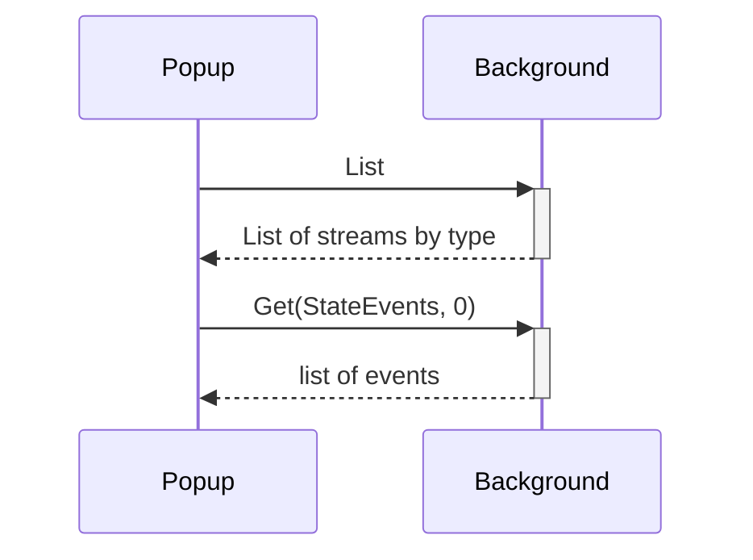
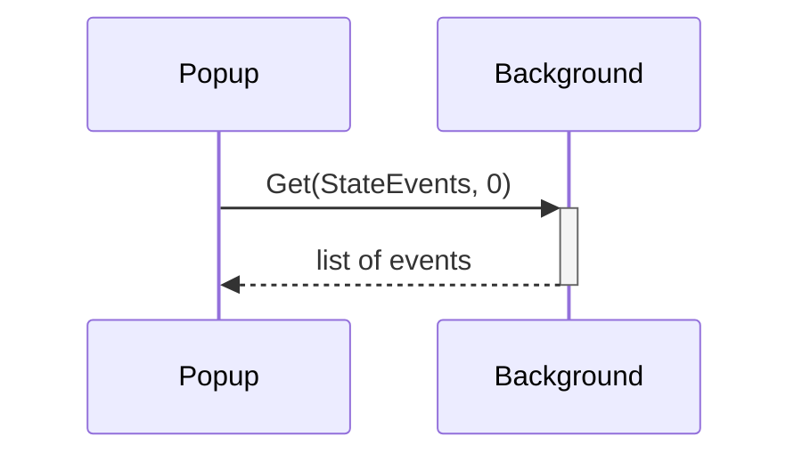
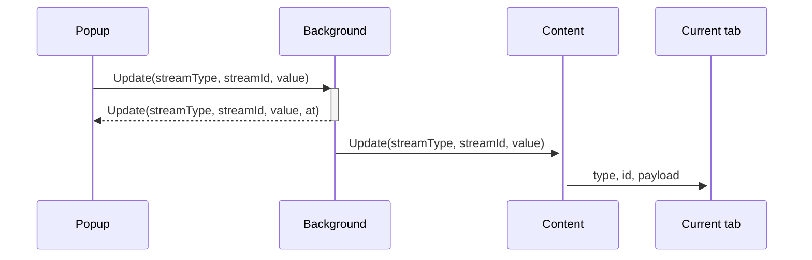
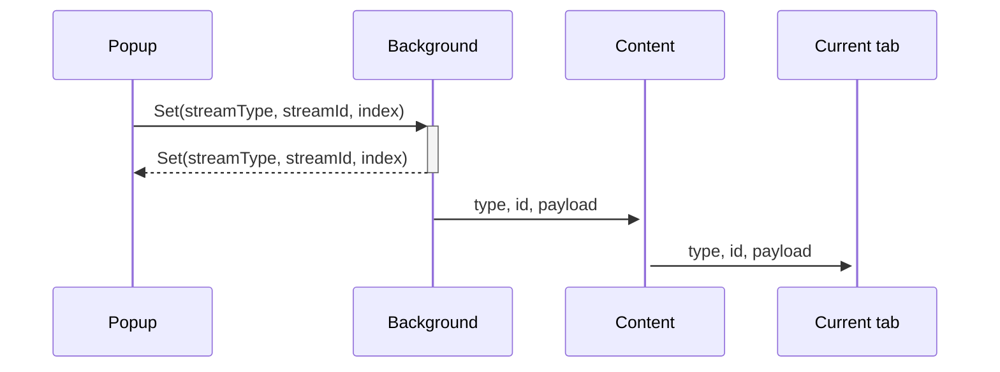

# react-state-event-devtool

A Chrome devtools extension for react-state-event.

## Message sequence: Initializing the panel
_Use case: the devTool panel is opened_

* Popup requests a list of streams
* Background responds with the list
* Popup requests the full history of the first stream if there is any
* Background responds with the full history of the stream


---
## Message sequence: Changing stream
_Use case: one of the stream buttons in the devTool panel is clicked_

* Popup requests the full history of the stream with the id that was clicked
* Background responds with the full history of the stream



---
## Message sequence: Updating with a new SET
_Use case: a valid JSON state is typed in the field and the button is clicked_

* Popup sends a new state to background
* Background responds with same message (update) to popup, to confirm
* Background sends a new state to content injected in current tab



---
## Message sequence: Setting state to history entry
_Use case: A previous entry in the history list is clicked_

* Popup sends a SET message with the history index to use
* Background responds with the same message (set) to popup, to confirm
* Background sends the state in the history entry to content injected in current tab



---
## Message format: from DevTools panel to background

These are the different message formats sent from the DevTools panel to the background:

### Set stream to JSON in input field (UPDATE)
```json
{
    "action": "update",
    "payload": {
        "streamType": "streamType",
        "streamId": "streamId",
        "value": "newEventPayload",
    }
}
```

### Set stream to state from history (SET)
```json
{
    "action": "set",
    "payload": {
        "streamType": "streamType",
        "streamId": "streamId",
        "index": 0,
    }
}
```

### Request full history of stream (GET)
```json
{
    "action": "get",
    "payload": {
        "streamType": "streamType",
        "streamId": "streamId",
    }
}
```

### Request current list of streams (LIST)
```json
{
    "action": "list"
}
```

---
## Message format: from background to DevTools panel
These are the different message formats sent from the the background to the DevTools panel:

### Response to request full history of stream (GET)
```json
{
    "action": "get",
    "at": 1,
    "payload": [
        {
            "streamType":"streamType",
            "streamId":"streamId",
            "value":"value"
        }
    ]
}
```

### Response to request current list of streams (LIST)
```json
{
    "action": "list",
    "payload": {
        "ExternalStateEvents": ["streamId"],
        "StateEvents": [1],
    }
}
```

### Update from content containing single event
```json
{
    "action": "append",
    "payload": {
        "streamType": "message.type",
        "streamId": "message.id",
        "value": "message.payload",
        "at": 0,
    }
}
```

---
## Message format: from content to background
These are the different message formats sent in reaction to an `event` received via a `message` window event in the content injected in the tab. The reaction messages are sent to the background via `chrome.runtime.sendMessage`.
The `event` is required to have `event.source` equal to the same window as the content and `event.origin` equal to the same origin as the content, so it should only come from the same tab where the content was injected.

## When `event.data.type` is `'react-state-event-devTool-streamId'`
```json
{
    "action": "new-stream",
    "type": "StateEvents",
    "id": "event.data.id",
    "payload": "event.data.payload"
}
```

## When `event.data.type` is `'react-state-event-devTool-notify'`
```json
{
    "action": "update",
    "type": "event.data.payload.streamType",
    "id": "event.data.payload.streamId",
    "payload": "event.data.payload.value"
}
```

## When `event.data.type` is `'react-state-event-initrequest'`
```json
{
    "action": "new-stream",
    "type": "ExternalStateEvents",
    "id": "event.data.name",
    "payload": "event.data.name"
}
```

---
## Message format: from content to library
These are the different message formats sent in reaction to a `msg` from background.
The reaction messages are sent to the library in the tab where content was injected and
origin is set to the origin of `msg`.

## When `msg.type` is `'StateEvents'`
```json
{
    "type": "react-state-event-devTool-set",
    "id": "msg.id",
    "payload": "msg.payload"
}
```

## When `msg.type` is `'ExternalStateEvents'`
```json
{
    "type": "react-state-event",
    "name": "msg.id",
    "success": true,
    "payload": "msg.payload"
}
```

---
## Message format: from content to library in tab
These are the different message formats sent in reaction to a `msg` received via a `chrome.runtime.onMessage` listener in the content injected in the tab. The reaction messages are sent within the same tab via `window.postMessage` and the origin is set to the same window.
The `msg` is required to have `msg.origin` equal to `react-state-event-devTool`, to verify it comes from the devTool background.

## When `msg.type` is `'StateEvents'`
```json
{
    "type": "react-state-event-devTool-set",
    "id": "msg.id",
    "payload": "msg.payload"
}
```

## When `msg.type` is `'ExternalStateEvents'`
```json
{
    "type": "react-state-event",
    "name": "msg.id",
    "success": true,
    "payload": "msg.payload"
}
```

# Getting Started with Create React App

This project was bootstrapped with [Create React App](https://github.com/facebook/create-react-app).

## Available Scripts

In the project directory, you can run:

### `npm start`

Runs the app in the development mode.\
Open [http://localhost:3000](http://localhost:3000) to view it in the browser.

The page will reload if you make edits.\
You will also see any lint errors in the console.

### `npm test`

Launches the test runner in the interactive watch mode.\
See the section about [running tests](https://facebook.github.io/create-react-app/docs/running-tests) for more information.

### `npm run build`

Builds the app for production to the `build` folder.\
It correctly bundles React in production mode and optimizes the build for the best performance.

The build is minified and the filenames include the hashes.\
Your app is ready to be deployed!

See the section about [deployment](https://facebook.github.io/create-react-app/docs/deployment) for more information.

### `npm run eject`

**Note: this is a one-way operation. Once you `eject`, you can’t go back!**

If you aren’t satisfied with the build tool and configuration choices, you can `eject` at any time. This command will remove the single build dependency from your project.

Instead, it will copy all the configuration files and the transitive dependencies (webpack, Babel, ESLint, etc) right into your project so you have full control over them. All of the commands except `eject` will still work, but they will point to the copied scripts so you can tweak them. At this point you’re on your own.

You don’t have to ever use `eject`. The curated feature set is suitable for small and middle deployments, and you shouldn’t feel obligated to use this feature. However we understand that this tool wouldn’t be useful if you couldn’t customize it when you are ready for it.

## Learn More

You can learn more in the [Create React App documentation](https://facebook.github.io/create-react-app/docs/getting-started).

To learn React, check out the [React documentation](https://reactjs.org/).

### Code Splitting

This section has moved here: [https://facebook.github.io/create-react-app/docs/code-splitting](https://facebook.github.io/create-react-app/docs/code-splitting)

### Analyzing the Bundle Size

This section has moved here: [https://facebook.github.io/create-react-app/docs/analyzing-the-bundle-size](https://facebook.github.io/create-react-app/docs/analyzing-the-bundle-size)

### Making a Progressive Web App

This section has moved here: [https://facebook.github.io/create-react-app/docs/making-a-progressive-web-app](https://facebook.github.io/create-react-app/docs/making-a-progressive-web-app)

### Advanced Configuration

This section has moved here: [https://facebook.github.io/create-react-app/docs/advanced-configuration](https://facebook.github.io/create-react-app/docs/advanced-configuration)

### Deployment

This section has moved here: [https://facebook.github.io/create-react-app/docs/deployment](https://facebook.github.io/create-react-app/docs/deployment)

### `npm run build` fails to minify

This section has moved here: [https://facebook.github.io/create-react-app/docs/troubleshooting#npm-run-build-fails-to-minify](https://facebook.github.io/create-react-app/docs/troubleshooting#npm-run-build-fails-to-minify)
